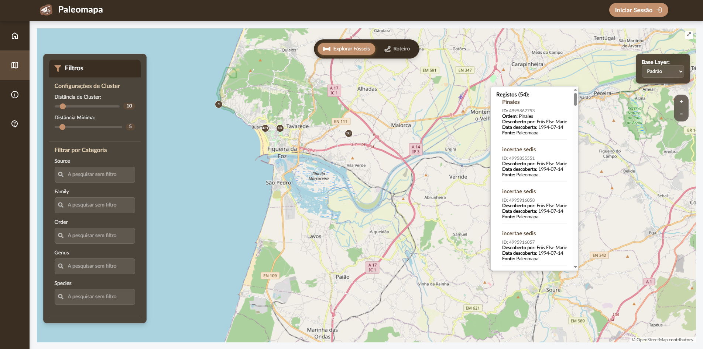
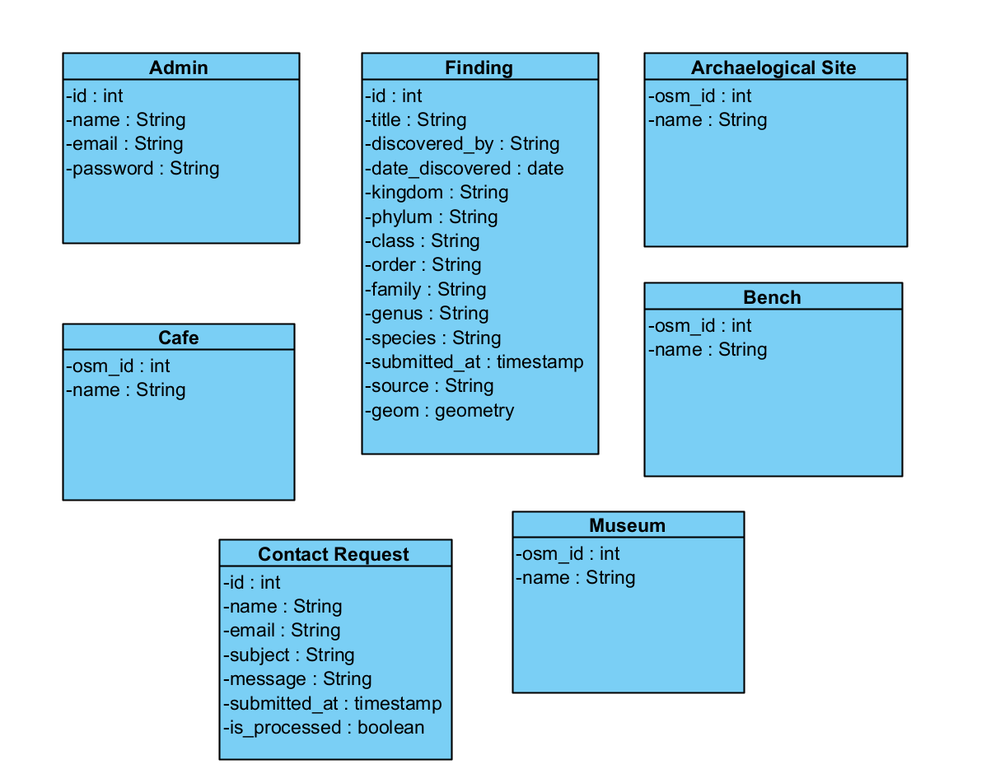

# 🦖 [PaleoMapa](https://gis4cloud.com/grupo2_ptas2025) - Interactive Paleontological Visualization System

**PaleoMapa** is an interactive web application for visualization, exploration, and management of paleontological data in Portugal. Developed with an educational and scientific focus, it integrates geospatial data with advanced filtering, geographic contextualization, and administration features.

🔗 **[Visit Online](https://gis4cloud.com/grupo2_ptas2025)**

## Main Features

- **Interactive Map** with visualization of fossils, archaeological sites, and points of interest.
- **Advanced Filtering** by geological age, fossil type (species, family, order, genus, etc.), and distance radius.
- **Admin Panel** for inserting, editing, and removing paleontological records and contact requests.
- **Geographic Contextualization** with museums, parks, cafés, and rest areas.
- **Automated Import** of paleontological data (Excel).
- **Automated Export** of paleontological data (SQL, Excel, CSV).
- **Isochrone Calculation** (travel time by foot, bicycle, or car - 5, 10, 15 minutes).
- **Custom Layers** with dynamic toggling.

## Screenshots




## Tech Stack

**Frontend:**
- [OpenLayers](https://openlayers.org/)
- [Turf.js](https://turfjs.org/)
- HTML, CSS, JavaScript

**Backend:**
- PHP (API)
- PostgreSQL (PostGIS and PgRouting extensions)

**Other:**
- QGIS (geodata pre-processing)
- Deck.gl (data visualization)

## Architecture

### Use Case Diagram


### Concept Diagram

### Database Diagram


## Prototypes

View the low-fidelity Figma prototype here: [Low-Fidelity Prototype](https://www.figma.com/design/07ZMQFUNTqLqmPhkWidxx0/Baixa_Fidelidade)

View the high-fidelity Figma prototype here: [High-Fidelity Prototype](https://www.figma.com/design/N4YeTplYTB1gXgQuZc8KSd/Paleomapa)

## Installation

1. Clone repository
```bash
git clone https://github.com/ratmir-mukazhanov/paleomapa
cd paleomapa
```
2. Create PostgreSQL database and enable PostGIS and PgRouting extensions
```bash 
PostGIS e PgRouting
psql -U your_user -c "CREATE DATABASE paleomapa;"
psql -U your_user -d paleomapa -c "CREATE EXTENSION postgis;"
```
> Make sure to replace `your_user` with your actual PostgreSQL username and you have PostgreSQL installed and running.
3. Import data into PostgreSQL
```bash
psql -U teu_utilizador -d paleomapa -f data/import.sql
```
4. Move the project files to your web server directory
5. Iniciar o servidor (Apache + PostgreSQL) com XAMPP, Laragon, etc.

## Credits

Our team is composed of dedicated students from the [University of Aveiro](https://www.ua.pt/):
- [Gustavo Gião](https://github.com/gustavogiao) — Team Lead
- [Ratmir Mukazhanov](https://github.com/ratmir-mukazhanov)
- [Filipe Rocha](https://github.com/FilipeFRocha)
- [Diogo Simão](https://github.com/dsimao7)

We would like to thank our professors [Luís Jorge Gonçalves](https://www.linkedin.com/in/lu%C3%ADs-jorge-gon%C3%A7alves-a5752414/) (Escola Superior de Tecnologia e Gestão de Águeda) and [Rute Lourenço Coimbra](https://www.ua.pt/pt/p/80482835) (Departamento de Geociências da Universidade de Aveiro) for their guidance and collaboration throughout this project.

## Data Source

The paleontological database used in this project was obtained from:
- [The Paleobiology Database](https://paleobiodb.org/)
- Sample data provided by the [Departamento de Geociências da Universidade de Aveiro](https://www.ua.pt/pt/geo/galeria)

All data rights belong to their respective owners.

## License

This project is licensed under the MIT License.

Consult the [`LICENSE`](licence.txt) file for more details.
